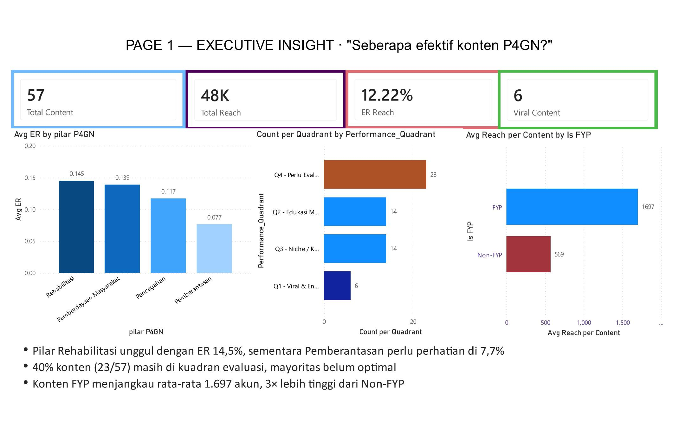
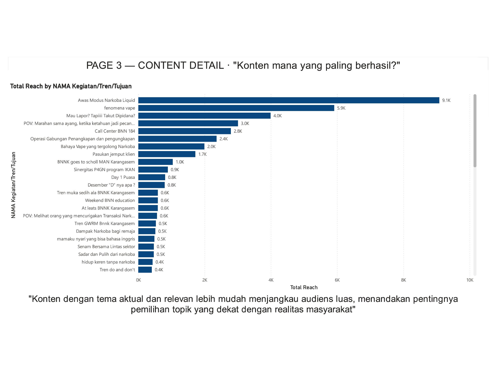

# powerbi-dashboard-p4gn
## 📌 Overview
Dashboard ini bertujuan menganalisis performa konten P4GN berdasarkan
reach, engagement, format konten, dan tipe konten.

## 🧩 Data Modeling
- Fact table: Performance Konten
- Dimension: Format, Tipe Konten, Waktu
- Relasi: 1-to-Many
- Measures terpisah (anti-BLANK, KPI-safe)

## 📊 Dashboard Overview

### Page 1 – Executive Summary

**Insight utama:**
- Reach tinggi tidak selalu berarti engagement tinggi
- Format visual pendek konsisten unggul
- Tipe konten edukatif lebih stabil dibanding viral

### Page 2 – Content Analysis

**Insight lanjutan:**
- Engagement rate tertinggi berasal dari format X
- Reach terbesar berasal dari tipe konten Y

### Page 3 – Top 10 content

**Insight lanjutan:**
- top 10 konten selama saya magang disana

## 🎯 Recommendation
- Gunakan format A untuk awareness
- Format B untuk engagement
- Optimasi kalender konten berbasis performa historis

## 📂 File
- Dashboard Power BI (.pbix)
- Insight analysis (PDF)
