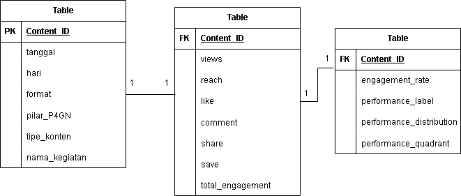

# Analisis Konten P4GN — Dashboard Power BI

## 📌 Overview

Dashboard ini menganalisis performa konten Instagram program P4GN
(Pencegahan dan Pemberantasan Penyalahgunaan dan Peredaran Gelap Narkotika)
selama periode magang di BNNK Karangasem, mencakup 57 konten yang
dipublikasikan antara November 2025–Mei 2026. Analisis berfokus pada
reach, engagement, format konten, tipe konten, dan pilar P4GN untuk
menghasilkan rekomendasi strategi konten yang berbasis data.

---

## 🗂️ Struktur Folder Proyek

```
├── assets/
│   ├── Analisis-konten-P4GN-page-1.jpg
│   ├── Analisis-konten-P4GN-page-2.jpg
│   ├── Analisis-konten-P4GN-page-3.jpg
│   └── ERD-Analisis-konten-P4GN.png
├── dashboard/
│   └── analisis-konten-p4gn-bnnk-karangasem.pbix
├── data/
│   ├── template-dashboard-p4gn-bnnk-karangasem.xlsx
│   ├── data-processing-p4gn.ipynb
│   ├── dataset-final-dashboard-p4gn.xlsx
│   └── dataset-dashboard-p4gn-quadrant.xlsx
├── report/
│   └── analisis-konten-p4gn-bnnk-karangasem.pdf
└── README.md
```

| File | Lokasi | Fungsi |
|---|---|---|
| `template-dashboard-p4gn-bnnk-karangasem.xlsx` | `data/` | Data mentah (raw) hasil rekap manual selama magang — satu sheet tunggal, belum melalui proses pembersihan |
| `data-processing-p4gn.ipynb` | `data/` | Notebook Python (Pandas) untuk transformasi data: regenerasi Content_ID, klasifikasi performa, dan penentuan quadrant |
| `dataset-final-dashboard-p4gn.xlsx` | `data/` | Output antara — data setelah Content_ID distandarkan dan Performance_Label (kualitas engagement) dihitung |
| `dataset-dashboard-p4gn-quadrant.xlsx` | `data/` | Dataset final ternormalisasi (3 tabel relasional) — digunakan langsung sebagai sumber data Power BI |
| `ERD-Analisis-konten-P4GN.png` | `assets/` | Diagram relasi antar tabel (Entity Relationship Diagram) yang menjadi dasar data modeling di Power BI |
| `analisis-konten-p4gn-bnnk-karangasem.pbix` | `dashboard/` | File dashboard Power BI — berisi seluruh data model, measure DAX, dan visual |
| `analisis-konten-p4gn-bnnk-karangasem.pdf` | `report/` | Ekspor dashboard dalam format PDF untuk pratinjau cepat tanpa perlu membuka Power BI |
| `Analisis-konten-P4GN-page-1.jpg` | `assets/` | Screenshot Page 1 — Executive Insight |
| `Analisis-konten-P4GN-page-2.jpg` | `assets/` | Screenshot Page 2 — Strategic Insight |
| `Analisis-konten-P4GN-page-3.jpg` | `assets/` | Screenshot Page 3 — Content Detail (Top 10) |

---

## 🧩 Data Modeling

Dataset dipecah menjadi struktur **star schema** dengan 3 tabel relasional,
dihubungkan melalui `Content_ID` sebagai primary key (relasi 1-to-many
dari tabel dimensi ke kedua tabel fakta):

- **dim_content** — metadata konten: Format, pilar P4GN, tipe konten, Tanggal, Hari, Nama Kegiatan/Tren/Tujuan
- **fact_performance** — metrik mentah: Views, Reach, Like, Comment, Save, Share, Total_Engagement
- **fact_analysis** — hasil kalkulasi: Engagement_Rate, Performance_Label, Performance_Distribution, Performance_Quadrant



Pemisahan ini mencegah double-counting saat measure dijalankan lintas
dimensi, dan memastikan setiap visual menghasilkan agregasi yang konsisten.

---

## 🧹 Data Cleaning & Feature Engineering

Proses transformasi data dilakukan menggunakan Python (Pandas) di
`data_processing_p4gn.ipynb`, dengan tiga tahap utama:

### 1. Standardisasi Content_ID
Content_ID di-generate ulang dengan format `CNT_YYYYMMDD_NNN`
berdasarkan tanggal publikasi dan urutan konten per hari, memastikan
setiap konten memiliki identifier unik dan konsisten sebagai kunci relasi.

```python
df['Content_ID'] = (
    'CNT_' +
    df['Tanggal'].dt.strftime('%Y%m%d') + '_' +
    df.groupby(['Tanggal']).cumcount().add(1).astype(str).str.zfill(3)
)
```

### 2. Klasifikasi Performa (Quantile-based)
Dua dimensi performa dihitung menggunakan ambang batas quantile 33%
dan 66%, menghasilkan kategori High/Medium/Low yang bersifat relatif
terhadap distribusi data riil — bukan ambang batas arbitrer:

- **Performance_Label** — dari Engagement_Rate (kualitas engagement)
- **Performance_Distribution** — dari Reach (luas jangkauan)

### 3. Penentuan Performance Quadrant
Kedua dimensi digabung menjadi 4 kuadran analitis untuk memudahkan
interpretasi strategis:

| Distribution | Label | Quadrant |
|---|---|---|
| High | High | Q1 - Viral & Engaged |
| High | Medium / Low | Q2 - Edukasi Massal / FYP |
| Medium / Low | High | Q3 - Niche / Komunitas |
| Medium / Low | Medium / Low | Q4 - Perlu Evaluasi |

```python
def assign_quadrant(dist, qual):
    if dist == 'High' and qual == 'High':
        return 'Q1 - Viral & Engaged'
    elif dist == 'High' and qual in ['Medium', 'Low']:
        return 'Q2 - Edukasi Massal / FYP'
    elif dist in ['Medium', 'Low'] and qual == 'High':
        return 'Q3 - Niche / Komunitas'
    else:
        return 'Q4 - Perlu Evaluasi'
```

Hasil akhir disimpan sebagai `dataset_dashboard_p4gn_quadrant.xlsx`,
yang menjadi sumber data tunggal untuk Power BI.

---

## 📐 DAX Measures

Measure dirancang anti-BLANK dan KPI-safe untuk menghindari hasil
yang ambigu atau tidak terdefinisi pada KPI card:

```dax
Total Content = DISTINCTCOUNT(dim_content[Content_ID])

Total Reach = SUM(fact_performance[Reach])

Total Engagement = SUM(fact_performance[Total_Engagement])

ER Reach = DIVIDE([Total Engagement], [Total Reach])

Viral Content =
CALCULATE(
    COUNTROWS(fact_analysis),
    fact_analysis[Performance_Quadrant] = "Q1 - Viral & Engaged"
)

Avg ER =
AVERAGEX(fact_analysis, fact_analysis[Engagement_Rate])

Avg Reach per Content = AVERAGE(fact_performance[Reach])
```

---

## 📊 Dashboard Overview

### Page 1 — Executive Insight
*Fokus: seberapa efektif konten P4GN secara strategis?*


**Isi:** KPI Cards (Total Content, Total Reach, ER Reach, Viral Content),
Avg ER by Pilar P4GN, Performance Quadrant Distribution, FYP vs Non-FYP.

**Insight utama:**
- Pilar Rehabilitasi mencatat ER tertinggi (14,5%), sementara
  Pemberantasan tertinggal di 7,7%
- 40% konten (23 dari 57) masih berada di kuadran Q4 yang memerlukan evaluasi
- Konten yang masuk kategori FYP menjangkau rata-rata 3× lebih banyak
  akun dibanding konten Non-FYP

### Page 2 — Strategic Insight
*Fokus: faktor apa yang memengaruhi performa konten?*


**Isi:** Avg ER by Format (donut), Total Reach by Tipe Konten (pie).

**Insight lanjutan:**
- Format Carousel menghasilkan ER tertinggi, jauh melampaui Video dan Foto
- Tipe konten Edukasi menyumbang mayoritas total reach, menjadikannya
  tulang punggung distribusi pesan P4GN

### Page 3 — Content Detail
*Fokus: konten mana yang terbukti paling berhasil?*


**Isi:** Top 10 Konten by Total Reach.

**Insight lanjutan:**
- Konten bertema isu aktual dan tren sosial mendominasi jangkauan
  tertinggi, menunjukkan relevansi topik sebagai faktor utama distribusi organik

---

## 🎯 Rekomendasi Strategis

- Tingkatkan proporsi format **Carousel** di seluruh pilar, khususnya
  pada pilar Pemberantasan yang ER-nya masih rendah
- Pertahankan dan perkuat konten bertipe **Edukasi** sebagai kontributor
  reach utama
- Fokuskan optimasi konten pada topik yang berpotensi masuk kategori
  **FYP** untuk memaksimalkan jangkauan organik
- Evaluasi ulang konten yang berada di kuadran **Q4 (Perlu Evaluasi)**
  untuk meningkatkan kualitas engagement secara keseluruhan

---

## 🛠️ Tools yang Digunakan

- **Python (Pandas)** — data cleaning & feature engineering
- **Microsoft Excel** — penyimpanan dan validasi data antar tahap
- **Power BI** — data modeling, DAX measures, dan visualisasi dashboard

---

## 📂 Cara Menggunakan

1. Buka `dashboard/analisis-konten-p4gn-bnnk-karangasem.pbix` dengan
   Power BI Desktop untuk eksplorasi interaktif
2. Atau lihat `report/analisis-konten-p4gn-bnnk-karangasem.pdf` untuk
   pratinjau cepat tanpa perlu instalasi Power BI
3. Source data mentah dan proses transformasi tersedia di
   `data/template-dashboard-p4gn-bnnk-karangasem.xlsx` dan
   `data/data-processing-p4gn.ipynb` untuk keperluan audit/reproduksi
